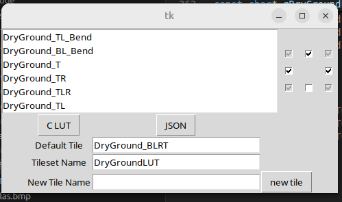
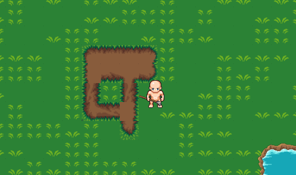

# Asset Tools

These are scripts and tools in the scripts folder, together they provide a means of converting source assets:
- [Tiled](https://www.mapeditor.org/) map files
- image files, .png's, .jpegs etc

Into the game engines binary format files:
- .atlas files
- .tilemap files (misnomer: also contain entities, will be renamed)

For specific command line usage pass -h to them.

## ConvertTiled.py

Create level files for your game using the program [Tiled](https://www.mapeditor.org/). Into the object layers you can add entities that are defined however you like defined as points, lines, polygons, boxes etc. Define the entities you want this way and give them any custom properties that they will need to have. 

Your game will implement python code that converts these into a binary file, as you will see.

The engine provides the implementation of (at the moment) exactly one entity type, the static collider. If you open the tiled project in ./WfAssets/engine.tiled-project you can see how these are defined.

Next we run a python script to convert the tiled .json file into a binary file the engine will load. To add your own type of entities to the file, extend the script the engine provides, ConvertTiled.py, like so:

```python

#
#   Serialize entity types for the game from the tiled json file
#   plugs into and extends engine/scripts/ConvertTiled.py
#

import sys
import os
import struct

print(os.path.abspath("../Stardew/engine/scripts"))
sys.path.insert(1, os.path.abspath("../Stardew/engine/scripts"))  
from ConvertTiled import main, register_entity_serializer, get_tiled_object_custom_prop

def serialize_WoodedArea(file, obj):
    # convert the json object to binary format
    # Our entity serializer needs to be able to load this 
    file.write(struct.pack("I", 1)) # version
    file.write(struct.pack("f", get_tiled_object_custom_prop(obj, "ConiferousPercentage")["value"]))
    file.write(struct.pack("f", get_tiled_object_custom_prop(obj, "DeciduousPercentage")["value"]))
    file.write(struct.pack("f", get_tiled_object_custom_prop(obj, "PerMeterDensity")["value"]))
    file.write(struct.pack("f", obj["width"]))
    file.write(struct.pack("f", obj["height"]))

def get_type_WoodedArea(obj):
    return 6                       # this corresponds to the entity type we used when we called Et2D_RegisterEntityType

register_entity_serializer("WoodedArea", serialize_WoodedArea, get_type_WoodedArea, False) # each 

main()

```

The ConvertTiled.py script takes a list of tiled json files as input, as output it will produces:
- for each input:
    - a .tilemap binary file
        - this contains the tilemaps and entities for the level
- an atlas.xml file
    - this contains the file paths of all tiles used within the all for all level files passed in and their coordinates within the file, as well as their width and height
    - it contains mappings of string names to certain tile indexes, which are settable in tiled by setting the "class" property for that specific tool in the tileset. In tiled it is called "class", but we're using it as "name" - the values should be unique, with no two tiles sharing a "class" 
    - the game can load an atlas from this directly or you can precompile it (recommended), see section below

## MergeAtlases.py

A tool that merges two atlases, use like so:

```shell
python3 engine/scripts/MergeAtlases.py ./WfAssets/out/atlas.xml ./WfAssets/out/named_sprites.xml > ./WfAssets/out/atlascombined.xml
```

Use it to combine a hand written atlas of sprites used for objects in the game with the atlas of tile sprites generated by ConvertTiled.py.

## AtlasTool

This is a tool written in C that will use an atlas.xml file to create an atlas of sprites that are defined in it. The game can quickly load this and use the individual sprites within, as it contains both the pixel data for the atlas and the coordinates of the individual sprites within.

The input xml files can also contain paths to fonts which will be rendered into the atlas at a specified size.

The tool does a passable but not great job of minimizing the overall size of the atlas given sprites of different sizes, it could be improved.

The good thing about this is one openGL texture can be used to draw the whole game layer, and it also means that only the tiles actually used, out of a potential source image of many more, need to be in the final loaded file.

In order to eliminate bleeding of texels from adjacent sprites the sprites in the atlas have a 1 pixel border that mimics GL_CLAMP_TO_EDGE texture clamping.

Here is an example xml input showing everything that is supported:

```xml
<!-- 
    Top level element specifies a range of sprites that are "the tileset". These are rendered in a tilemap, an array filled with their Indexes, generated from
    a json produced by tiled. The tilesetStart and tilesetEnd indices refer to sprites in the map, in the order they are written. Animations add their animations in order and contribute to the index as do fonts, so i recommend putting the tilemap sprites first, then named sprites of differing size, then everything else, if writing one of these files by hand and not using ConvertTiled.py, and in the hand written portion that you merge with the ConvertTiled.py output
    
 -->
<atlas tilesetStart="0" tilesetEnd="4">
    <!-- 
        The sprites in the tileset must all be the same size. The name here is added by the script, but it doesn't really matter as it will be refered to by index
        as its in the tile map. The game can also use the name to get a sprite handle and use for rendering outside the tilemap though. 
    -->
    <sprite source="./WfAssets/Image/LPC Submissions/Exterior Tiles.png" top="128" left="0" width="32" height="32" name="Exterior Tiles_0" />
    <sprite source="./WfAssets/Image/LPC Submissions/Exterior Tiles.png" top="128" left="32" width="32" height="32" name="Exterior Tiles_1" />
    <sprite source="./WfAssets/Image/LPC Submissions/Exterior Tiles.png" top="0" left="64" width="32" height="32" name="Exterior Tiles_2" />
    <sprite source="./WfAssets/Image/LPC Submissions/Exterior Tiles.png" top="128" left="64" width="32" height="32" name="Exterior Tiles_3" />
    <sprite source="./WfAssets/Image/LPC Submissions/Exterior Tiles.png" top="256" left="0" width="32" height="32" name="Exterior Tiles_4" />
    
    <!-- sprites that come after (hand named ones) can be any size, obviously -->
    <sprite source="./WfAssets/Image/LPC Submissions/Outside Objects.png" top="320" left="288" width="96" height="128" name="conif_tree_aut_top_2" bMinimizeSpace="true" />

    <!-- 
        gameplay code that needs to alter the tilemap can call At_LookupNamedTile to lookup tiles by name, so they can be added to in any order.
        ConvertTiled.py generates these from the "class" property in tiled tileset jsons, which you can set from the tiled gui
     
    -->
    <named-tiles>
     <mapping name="myTileNameA" index="37" />
     <mapping name="myTileNameB" index="38" />
    </named-tiles>

    <!-- 
        Sprites grouped together as animations with suggested FPS. 
        A convenience script exists to generate these with less boilerplate, ExpandAnimations.py, but the syntax that that code accepts isn't directly supported
        by the atlas code, so that script is used as a post processing step to generate an element that looks like this (or you could write this directly):
    -->
    <animation-frames name="walk-base-male-up" fps="10.0">
		<sprite source="./WfAssets/Image/lpc_base_assets/LPC Base Assets/sprites/people/male_walkcycle.png" top="0" left="0" width="64" height="64" bMinimizeSpace="true" name="walk-base-male-up0" />
		<sprite source="./WfAssets/Image/lpc_base_assets/LPC Base Assets/sprites/people/male_walkcycle.png" top="0" left="64" width="64" height="64" bMinimizeSpace="true" name="walk-base-male-up1" />
		<sprite source="./WfAssets/Image/lpc_base_assets/LPC Base Assets/sprites/people/male_walkcycle.png" top="0" left="128" width="64" height="64" bMinimizeSpace="true" name="walk-base-male-up2" />
		<sprite source="./WfAssets/Image/lpc_base_assets/LPC Base Assets/sprites/people/male_walkcycle.png" top="0" left="192" width="64" height="64" bMinimizeSpace="true" name="walk-base-male-up3" />
		<sprite source="./WfAssets/Image/lpc_base_assets/LPC Base Assets/sprites/people/male_walkcycle.png" top="0" left="256" width="64" height="64" bMinimizeSpace="true" name="walk-base-male-up4" />
		<sprite source="./WfAssets/Image/lpc_base_assets/LPC Base Assets/sprites/people/male_walkcycle.png" top="0" left="320" width="64" height="64" bMinimizeSpace="true" name="walk-base-male-up5" />
		<sprite source="./WfAssets/Image/lpc_base_assets/LPC Base Assets/sprites/people/male_walkcycle.png" top="0" left="384" width="64" height="64" bMinimizeSpace="true" name="walk-base-male-up6" />
		<sprite source="./WfAssets/Image/lpc_base_assets/LPC Base Assets/sprites/people/male_walkcycle.png" top="0" left="448" width="64" height="64" bMinimizeSpace="true" name="walk-base-male-up7" />
		<sprite source="./WfAssets/Image/lpc_base_assets/LPC Base Assets/sprites/people/male_walkcycle.png" top="0" left="512" width="64" height="64" bMinimizeSpace="true" name="walk-base-male-up8" />
	</animation-frames>
</atlas>
```

### Minimize Space

An optimization to make smaller atlases

You can pass `bMinimizeSpace` as an xml attribute for a sprite, it allows you to define a notional width and height for a sprite, for example all sprites are 64x64, but the tool will trim all transparent space from around the sprite storing the minimum pixels.

The sprite struct stores a widthPx and heightPx as well as an "actualWidthPx" and "actualHeightPx", as well as an offset from the top left to apply to the "actual" sprite.

Low level rendering code in Sprite.c and AnimatedSprite.c handle the offset, so that gameplay code can operate on large sprites when only the minimum pixels are stored in the atlas.

Don't pass `bMinimizeSpace` for sprites used in UI, because that rendering code doesn't handle it.

## ExpandAnimations.py

Expands </animation> nodes in xml files. You can write an animation node like this in an atlas xml file:

```xml
<animation name="walk-base-female-down"
            fps="10.0"
            source="./WfAssets/Image/lpc_base_assets/LPC Base Assets/sprites/people/female_walkcycle.png"
            startx="0"
            starty="0"
            incx="64"
            incy="64"
            width="64"
            height="64"
            numFrames="9"
            bMinimizeSpace="true"/>
```

And this script will expand it like so:

```xml
<animation-frames name="walk-base-female-down" fps="10.0">
    <sprite source="./WfAssets/Image/lpc_base_assets/LPC Base Assets/sprites/people/female_walkcycle.png" top="128" left="0" width="64" height="64" name="walk-base-female-down0" bMinimizeSpace="true"/>
    <sprite source="./WfAssets/Image/lpc_base_assets/LPC Base Assets/sprites/people/female_walkcycle.png" top="128" left="64" width="64" height="64" name="walk-base-female-down1" bMinimizeSpace="true"/>
    <sprite source="./WfAssets/Image/lpc_base_assets/LPC Base Assets/sprites/people/female_walkcycle.png" top="128" left="128" width="64" height="64" name="walk-base-female-down2" bMinimizeSpace="true"/>
    <sprite source="./WfAssets/Image/lpc_base_assets/LPC Base Assets/sprites/people/female_walkcycle.png" top="128" left="192" width="64" height="64" name="walk-base-female-down3" bMinimizeSpace="true"/>
    <sprite source="./WfAssets/Image/lpc_base_assets/LPC Base Assets/sprites/people/female_walkcycle.png" top="128" left="256" width="64" height="64" name="walk-base-female-down4" bMinimizeSpace="true"/>
    <sprite source="./WfAssets/Image/lpc_base_assets/LPC Base Assets/sprites/people/female_walkcycle.png" top="128" left="320" width="64" height="64" name="walk-base-female-down5" bMinimizeSpace="true"/>
    <sprite source="./WfAssets/Image/lpc_base_assets/LPC Base Assets/sprites/people/female_walkcycle.png" top="128" left="384" width="64" height="64" name="walk-base-female-down6" bMinimizeSpace="true"/>
    <sprite source="./WfAssets/Image/lpc_base_assets/LPC Base Assets/sprites/people/female_walkcycle.png" top="128" left="448" width="64" height="64" name="walk-base-female-down7" bMinimizeSpace="true"/>
    <sprite source="./WfAssets/Image/lpc_base_assets/LPC Base Assets/sprites/people/female_walkcycle.png" top="128" left="512" width="64" height="64" name="walk-base-female-down8" bMinimizeSpace="true"/>
</animation-frames>
```

Example usage:

```bash
python3 ./engine/scripts/ExpandAnimations.py -o ./expanded_test.xml ./WfAssets/out/named_sprites.xml
```

## Example Compile Assets Script

I recommend you create and maintain a compile assets script as you add assets to the game. For example:

```bash
# convert jsons from the Tiled editor to binary files containing tilemaps and entities + an atlas.xml file of the tiles used
python3 game/game_convert_tiled.py ./WfAssets/out -m ./WfAssets/Farm.json ./WfAssets/House.json ./WfAssets/RoadToTown.json 

# expand animation nodes
python3 ./engine/scripts/ExpandAnimations.py -o ./WfAssets/out/expanded_named_sprites.xml ./WfAssets/out/named_sprites.xml

# merge the list of named sprites into the ones used by the tilemap
python3 engine/scripts/MergeAtlases.py ./WfAssets/out/atlas.xml ./WfAssets/out/expanded_named_sprites.xml > ./WfAssets/out/atlascombined.xml

# compile the atlascombined.xml into a binary atlas file
./build/atlastool/AtlasTool ./WfAssets/out/atlascombined.xml -o ./WfAssets/out/main.atlas -bmp Atlas.bmp

# compile another atlas file containing sprites and fonts for the games UI 
./build/atlastool/AtlasTool ./WfAssets/ui_atlas.xml -o ./WfAssets/ui_atlas.atlas -bmp UIAtlas.bmp

```
A make file would be even better.


## TerrainTileCodegenGUI.py

A gui tool for generating lookup tables for tiles vbased on their neighbours

```
usage: Terrain Tile Code generator [-h] [--atlas_xml ATLAS_XML] [--json JSON]

    ------> X
    |
    |      ________
    V     |_0|_1|_2|
    Y     |_3|_A|_4|
          |_5|_6|_7|

    A GUI to produce a C lookup table for "terrain" sets.
    
    The tile A in the middle is determined by the surrounding tiles.
    The bits of an 8 bit index are set according tiles 1-7 according to the diagram above.

    Use this gui to set whether each position 0-7 contains a tile from the set, doesn't or can contain one or not.

    It generates a C lookup table and json file containing the permutations for the "wildcard" tiles.

options:
  -h, --help            show this help message and exit
  --atlas_xml ATLAS_XML
                        atlas_xml produced by compile_assets.sh
  --json JSON           json file output by this tool
```
{ align=left }

It can load the names of tiles from the named tile section of an atlas xml file, and can output a json file (which can be reloaded by the tool) or a C file and header file lookup table.

Set the locations of surrounding tiles which if they occur should result in the selected tile being chosen.
The grid of check boxes on the right signify symbolize tiles to the tile chosen in the listbox.
- A solid check mark indicates there's a tile there, 
- an unchecked check mark indicates no tile, 
- a greyed out one indicates there can be a tile or not.
    - if a tile has all grey checkmarks its ignored in the output

The gui produces a lookup table, designed for an 8 bit index encoded like so, for a tile at A:

```
    ------> X
    |
    |      ________
    V     |_0|_1|_2|
    Y     |_3|_A|_4|
          |_5|_6|_7|
```

If a tile has a greyed out check mark both permutations are generated and put into the table as that tile.

The generated C code is like this:

```c
// Generated by TerrainTileCodegenGUI.py

#include "DryGroundLUT.h"
const char* gDryGroundLUT[256] = {
	"DryGround_Center",
	"DryGround_Center",
	"DryGround_T",
	"DryGround_T",
	"DryGround_Center",
	"DryGround_Center",
	"DryGround_T",
	"DryGround_T",
	"DryGround_L",
	"DryGround_L",
	"DryGround_TL_Bend",
	"DryGround_TL",
	"DryGround_L",
	"DryGround_L",
	"DryGround_TL_Bend",
	"DryGround_TL",
	"DryGround_R",
	"DryGround_R",
	"DryGround_TR_Bend",
    // more not shown...
};

const char* gDryGroundLUT_Names[DryGroundLUT_NamesLen] = {
	"DryGround_BR_Bend",
	"DryGround_Center",
	"DryGround_B",
	"DryGround_BR",
	"DryGround_BLR",
	"DryGround_BL",
	"DryGround_CornerTuft_TL_TR",
	"DryGround_CornerTuft_TR",
	"DryGround_CornerTuft_TR_BR_BL",
	"DryGround_R",
	"DryGround_LR",
	"DryGround_L",
	"DryGround_TB",
	"DryGround_BRT",
	"DryGround_BLRT",
	"DryGround_BLT",
	"DryGround_CornerTuft_TL_BL",
	"DryGround_CornerTuft_TL",
	"DryGround_CornerTuft_TL_TR_BR",
	"DryGround_TR_Bend",
	"DryGround_TL_Bend",
	"DryGround_BL_Bend",
	"DryGround_T",
	"DryGround_TR",
	"DryGround_TLR",
	"DryGround_TL",
	"DryGround_CornerTuft_BL_BR",
	"DryGround_CornerTuft_BL",
	"DryGround_CornerTuft_TL_TR_BL",
};

```
The tile name specified under defaul tile is put into all slots in the table that haven't been specifically set.

You can use it to fit the correct tiles together in your game for things like this:

{ align=left }

Calculate an 8 bit index into the array where a bit should be set if the tile is any in gDryGroundLUT_Names and unset for anything else.

